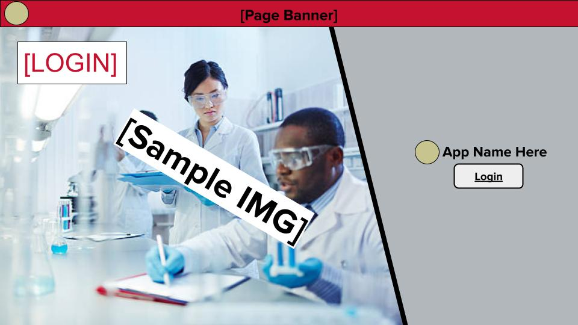

# Project Design Document

## Your Project Title
--------
Prepared by:

* `Brandon Proteau`,`WPI`
* `Matthew Amodea`,`WPI`
* `Chase Carstensen`,`WPI`
* `Ryan Anderson`,`WPI`
---

**Course** : CS 3733 - Software Engineering 

**Instructor**: Sakire Arslan Ay

---

## Table of Contents
- [1. Introduction](#1-introduction)
- [2. Software Design](#2-software-design)
    - [2.1 Database Model](#21-model)
    - [2.2 Modules and Interfaces](#22-modules-and-interfaces)
    - [2.2.1 Overview](#221-overview)
    - [2.2.2 Interfaces](#222-interfaces)
    - [2.3 User Interface Design](#23-view-and-user-interface-design)
- [3. References](#3-references)
<!-- - [Appendix: Grading Rubric](#appendix-grading-rubric) -->

### Document Revision History

| Name | Date | Changes | Version |
| ------ | ------ | --------- | --------- |
|Revision 1 |2025-02-13 |Initial draft | 1.0        |
|      |      |         |         |

# 1. Introduction

<!-- Explain the purpose of this document. If this is a revision of an earlier document, please make sure to summarize what changes have been made during the revision (keep this discussion brief).  -->

This document serves to overview the structure and design of our team's software. 

# 2. Software Design

<!-- (**Note**: For all subsections of Section-2: You should describe the design for the end product (completed application) - not only your iteration1 version. You will revise this document and add more details later.) -->

## 2.1 Database Model

<!-- Provide a list of your tables (i.e., SQL Alchemy classes) in your database model and briefly explain the role of each table.  -->
|Table|Members|Example Fields|
|-|-|-|
|User|Users of the program and their information. |wpi id, phone number, name, email|
|Faculty|Users which have been registered as faculty members of WPI. Must have a wpi faculty email.|created topics|
|Student|Users which are registered as a wpi student. Students have wpi email addresses.|gpa, graduation date|
|ResearchTopic|Either a research field which students and projects may affiliate with or language which student may claim proficiency. Professors may create research topics and destroy topics which they have made.|topic name, topic type, creator|
|ResearchProject|Projects created by faculty. Each Research Project will have their own page which displays information on the project and has a way for Student users to apply to join the project.|project name, start date, end date, number of positions, creator|
|Major|Different majors which students can associate themselves with. For example: 'Aerospace Engineering', 'Mathematical Sciences', etc.|name, abbreviated name|
|Application|Information from the applications for joining research projects filled out by students. Each application should be associated with a single Student (who filled it out) and a single Research Project (which the application is for).|student id, project id, status, student statements|

<!-- Provide a UML diagram of your database model showing the associations and relationships among tables.  -->
The following is a UML Database Diagram of our Database, with association tables.
</img>

## 2.2 Modules and Interfaces

### 2.2.1 Overview
The software application is structured into five distinct modules: Client, Model, Auth, Main, and Error Handlers. The Client module, represented by the browser, initiates HTTP requests to interact with the application. The Model module functions as the data layer, defining the data schema and managing database tables through SQLAlchemy, which facilitates communication with an SQLite database. The remaining application logic is divided into three interconnected subsystems. The Auth subsystem handles user authentication, including registration and login. The Main module contains the core functionality of the application, processing requests and executing business logic. The Error Handlers module is responsible for managing system responses to errors, such as 404 (Not Found) and 500 (Internal Server Error). These subsystems communicate primarily through redirects. The Client sends HTTP requests to the appropriate subsystem endpoints, which process the requests and return responses accordingly.

</img>
<!-- Describe the high-level architecture of your software:  i.e., the major components/modules and how they fit together. Provide a UML component diagram that illustrates the architecture of your software. Briefly mention the role of each module in your architectural design. Please refer to the "System Level Design" lectures in Week 4.  -->

### 2.2.2 Interfaces

<!-- Include a detailed description of the routes your application will implement. 
* Brainstorm with your team members and identify all routes you need to implement for the **completed** application.
* For each route specify its “methods”, “URL path”, and “a description of the operation it implements”.  
* You can use the following table template to list your route specifications. 
* Organize this section according to your module decomposition, i.e., include a sub-section for each module and list all routes for that sub-section in a table.   -->

#### 2.2.2.1 /main Routes

|   | Function           | URL Path   | Methods  | Description  |
|:--|:------------------|:-----------|:-------------| :-------------|
|1. |index|/,/index|GET| Renders home page dependant on current user type, requires login, redirects to login if no user is signed in.
|2. |displayProfile|/user/\<user-id\>|GET|Renders the correct profile template based on the current users type and populates it with current user info. Redirects to index if user not signed in.|
|3. |editProfile|/user/profile/\<user-id\>/edit|GET, POST| Renders user profile edit template and parses edit profile form to update account, redirects to profile.
|4. |createProject|/project/create|GET, POST|Renders project creation form/template, adds new project to the database. Requires current user to be faculty, redirects to index if not.|
|5. |editProject|/project/\<project-id\>/edit|GET, POST|Renders project edit form/template, edits project details in database. Requires current user to be faculty, redirects to index if not.|
|6. |displayProjects|/project/view|GET|Renders project browser template, displays all projects in database. Requires login, redirects to index.|
|7. |displayProjectData|/project/\<project_id\>/view|GET|Renders project browser template, displays a single project in database. Requires login, redirects to index.|
|8. |createLang|/topic/lang/create|GET, POST|Renders create topic template with LangForm object, validates form and creates a new ResearchTopic with type 'language'. Faculty only.|
|9. |createField|/project/field/create|GET, POST|Renders create topic template with FieldForm object, validates form and creates a new ResearchTopic with type 'field'. Faculty only.|
|10. |apply|/project/\<project_id\>/apply|GET, POST|Renders application template with ApplyForm object, validates form and creates a new application object. Student only.|
|11. |viewApplicants|/project/\<project_id\>/applicants|GET, POST|Displays all students who have applied for a given project. Receives POST requests to sort applications. Highlights applicants who match all position requirements.| Faculty only.|
|12. |decideApplicant|/project/\<project_id\>/applicants/\<user_id\>|GET, POST|Displays a specific students application, and allows faculty to decide on that applications (accept/reject), a note can be attached to the decision and the student is notified following the decision. Faculty only.|
|13. |requestReference|/user/\<faculty_id\>/reference|GET, POST|Renders reference request template with RefRequestForm object, validates form and creates a new reference request for the faculty member. Notifies the faculty member. Student only.|
|14. |completeReference|/user/\<student_id\>/reference|GET, POST|Renders reference writing template with ReferenceForm object, validates form and creates a new reference for the student. Notifies the student. Faculty only.|
|15. |inbox|/user/\<user_id\>/inbox|GET, POST|Displays all inbox messages for each user. Receives POST requests to sort the inbox.|

#### 2.2.2.2 /auth Routes

|   | Function           | URL Path   | Methods  | Description  |
|:--|:------------------|:-----------|:-------------| :-------------|
|1. |registerUser|/user/register| GET, POST | Renders user registration template and parses registration form to make new users, redirects to index. If the provided email is in the list of existing faculty members, create a faculty account, otherwise create a student account.|
|2. |login|/user/login|GET, POST| Renders login template with the login form and parses data to authenticate the user. If user is finished registration it logs the user in and redirects to index, if the user is a student who has not finished registration, it redirects to studentRegister.|
|3. |logout|/user/logout|POST|Logs the current user out, redirects to login.|
|4. |studentRegister|/user/register/student/\<user_id\>|GET, POST|Renders the second part of the student registration form/template. Validates the form and finishes creating a new student user.|

#### 2.2.2.2 /errors Routes

|   | Function           | URL Path   | Methods  | Description  |
|:--|:------------------|:-----------|:-------------|:-------------|
|1. |not_found_error|/error/404|GET| Handles invalid route errors|
|2. |internal_error|/error/500|GET|Handles internal/server errors.|

### 2.3 User Interface Design 

<!-- Provide a list of the page templates you plan to create and supplement your description with UI sketches or screenshots.  -->

  ## Mock Up Pages
  <kbd>
    Image of login template
    </img>
    Image of home template
    </img>
    Image of home page with user dashboard dropdown template 
    </img>
    Image of user profile template
    </img>
    Image of edit user profile template
    </img>
    Image of user inbox template
    </img>
    Image of project submission template
    </img>
    Image of project browser 
    </img>
    Image of project search template 
    </img>
    Image of individual project research page
    </img>
    Image of project proposal page
    </img>
    Image of create topic template
    </img>
    Image of edit faculty profile template
    </img>
    Image of faculty profile template
    </img>
    Image of inbox email template
    </img>
    Image of personal statement creation template
    </img>
    Image of individual project applicants template
    </img>
    Image of list of project applicants template
    </img>
    
  </kbd>

# 3. References

None

<!-- Cite your references here.

For the papers you cite give the authors, the title of the article, the journal name, journal volume number, date of publication and inclusive page numbers. Giving only the URL for the journal is not appropriate.

For the websites, give the title, author (if applicable) and the website URL. -->

----
<!-- # Appendix: Grading Rubric
(Please remove this part in your final submission)

 * You will first  submit a draft version of this document:
    * "Project 3 : Project Design Document - draft" (5pts). 
* We will provide feedback on your document and you will revise and update it.
    * "Project 5 : Project Design Document - final" (80pts) 

Below is the grading rubric that we will use to evaluate the final version of your document. 

|**MaxPoints**| **Design** |
|:---------:|:-------------------------------------------------------------------------|
|           | Are all parts of the document in agreement with the product requirements? |
| 8         | Is the architecture of the system ([2.2.1 Overview](#221-overview)) described well, with the major components and their interfaces?         
| 8        | Is the database model (i.e., [2.1 Database Model](#21-database-model)) explained well with sufficient detail? Do the team clearly explain the purpose of each table included in the model?| 
|          | Is the document making good use of semi-formal notation (i.e., UML diagrams)? Does the document provide a clear UML class diagram visualizing the DB model of the system? |
| 18        | Is the UML class diagram complete? Does it include all classes (tables) and does it clearly mark the PK and FKs for each table? Does it clearly show the associations between them? Are the multiplicities of the associations shown correctly? ([2.1 Database Model](#21-database-model)) |
| 25        | Are all major interfaces (i.e., the routes) listed? Are the routes explained in sufficient detail? ([2.2.2 Interfaces](#222-interfaces)) |
| 13        | Is the view and the user interfaces explained well? Did the team provide the screenshots of the interfaces they built so far.  ([2.3 User Interface Design](#23-user-interface-design)) |
|           | **Clarity** |
|           | Is the solution at a fairly consistent and appropriate level of detail? Is the solution clear enough to be turned over to an independent group for implementation and still be understood? |
| 5         | Is the document carefully written, without typos and grammatical errors?  |
| 3         | Is the document well formatted? (Make sure to check your document on GitHub. You will loose points if there are formatting issues in your document.  )  |
|           |  |
| 80         | **Total** |
|           |  | -->